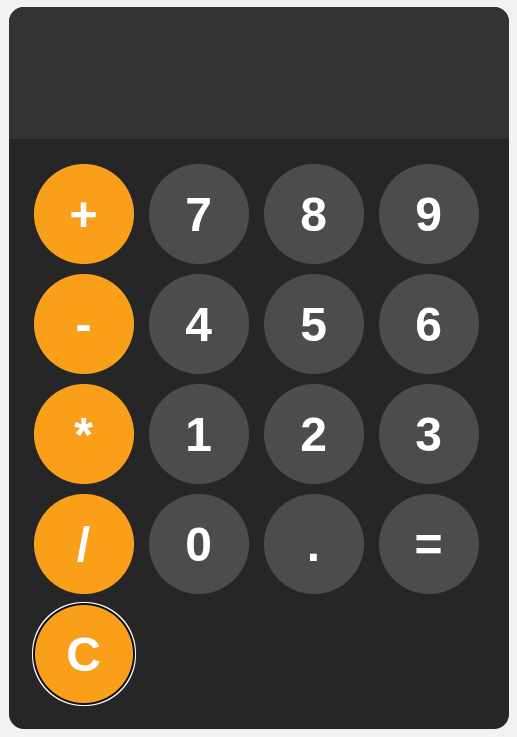

# Simple Calculator

A practice project following [Web Dev Simplified's calculator tutorial](https://www.youtube.com/watch?v=I5kj-YsmWjM).

Built with HTML, CSS, and JavaScript to learn front-end development fundamentals.

## Credit

This project was created by following [Web Dev Simplified's "Build A Calculator With JavaScript" tutorial](https://www.youtube.com/watch?v=I5kj-YsmWjM). All credit for the project concept and implementation approach goes to the original creator.

## Features

- Basic arithmetic operations (+, -, *, /)
- Responsive design
- Clean UI with hover effects
- Error handling
